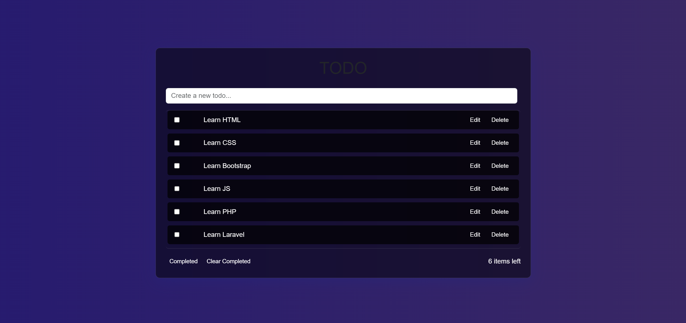

# Preview


# To-Do List Project
This project is a simple and interactive to-do list where users can add, edit, and delete tasks.

## Technologies Used
This project is built with:
- 
- 
- 
- 

## Features
- Add new tasks to the to-do list.
- Edit existing tasks directly in place.
- Delete tasks once they are completed.
- Responsive design using Bootstrap.
- Interactive and dynamic task management using JavaScript.

## Installation
Steps to install and run the project.

```bash
# Clone the repository
git clone https://github.com/username/repository.git

# Navigate to the project folder
cd repository

# Open the project in a browser
open index.html
